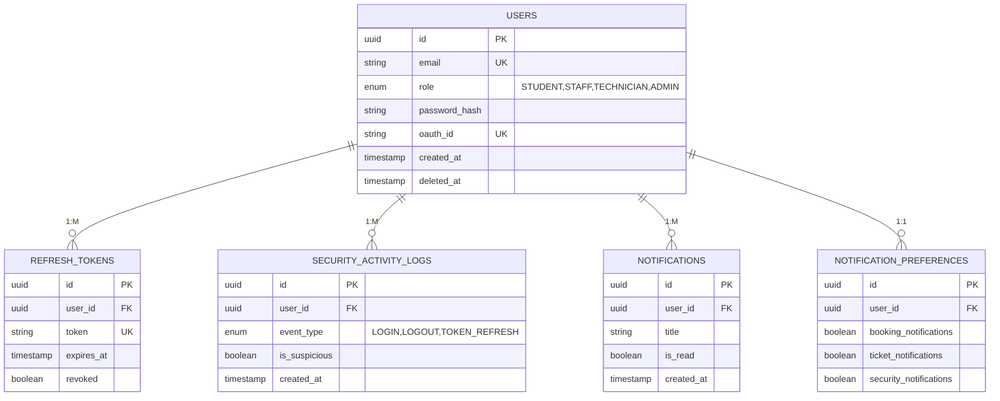
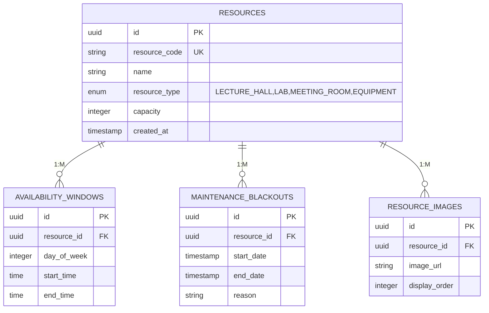
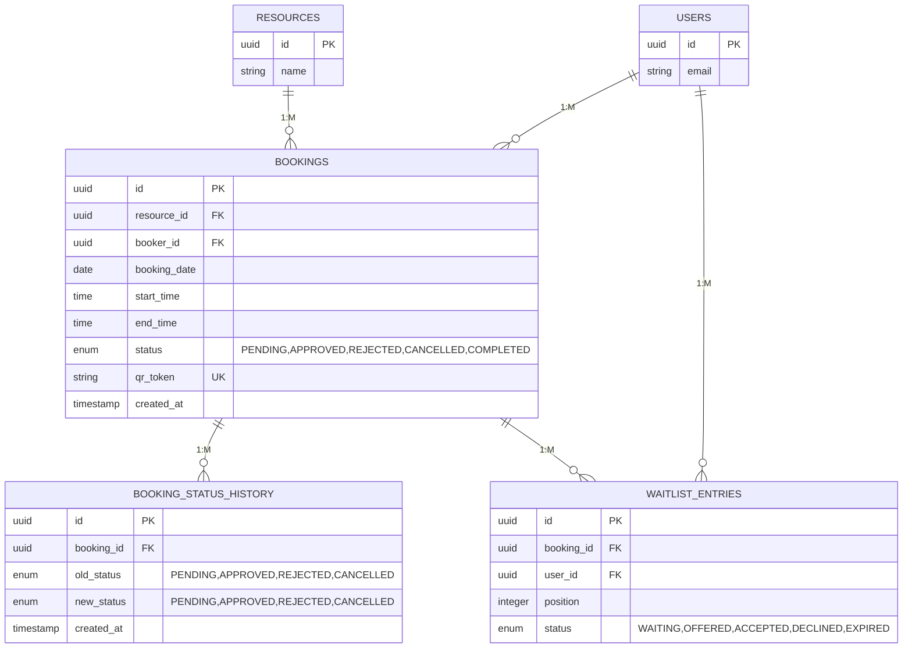
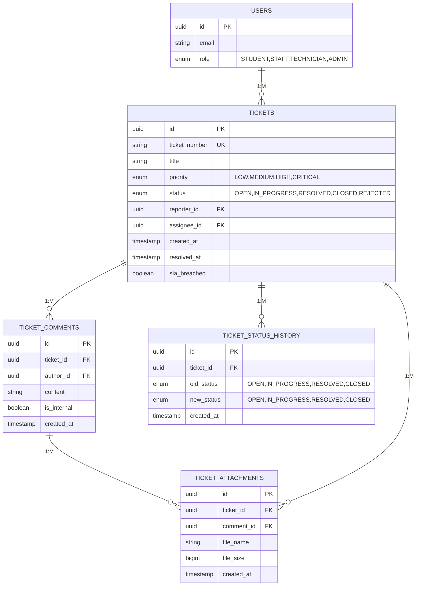
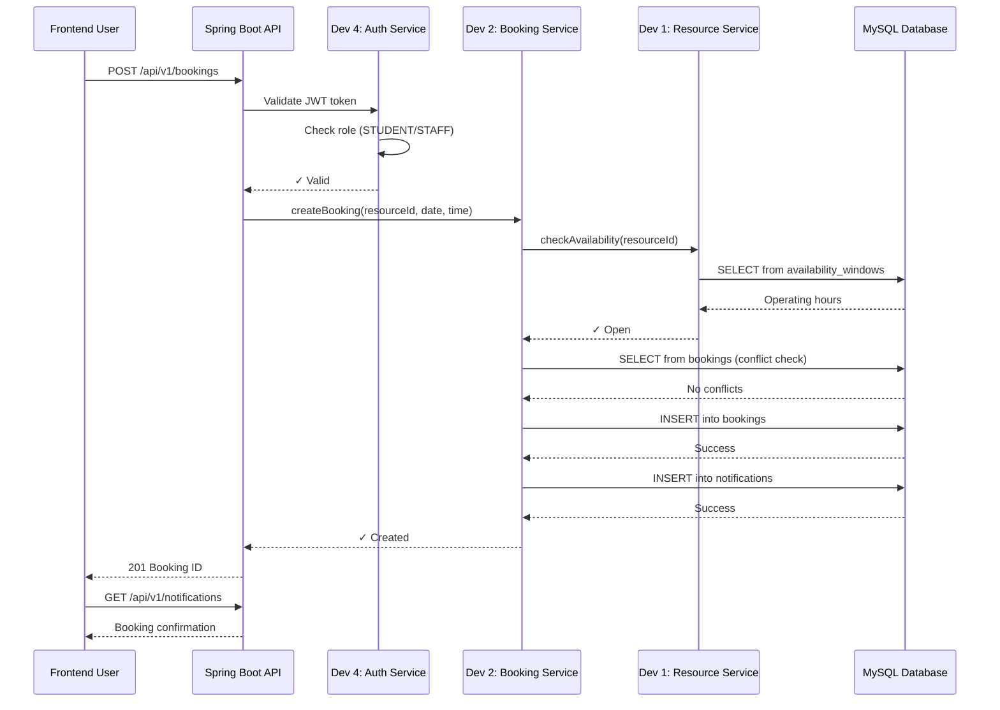

# Smart Campus Database - Entity Relationship Diagram
**Generated**: 21 April 2026  
**Format**: Mermaid ERD

---

## Complete Entity Relationship Diagram

```mermaid
erDiagram
    USERS ||--o{ NOTIFICATIONS : "1:M"
    USERS ||--o{ REFRESH_TOKENS : "1:M"
    USERS ||--o{ SECURITY_ACTIVITY_LOGS : "1:M"
    USERS ||--o{ NOTIFICATION_PREFERENCES : "1:1"
    USERS ||--o{ BOOKINGS : "1:M (as booker_id)"
    USERS ||--o{ BOOKINGS : "1:M (as approved_by)"
    USERS ||--o{ BOOKINGS : "1:M (as checked_in_by)"
    USERS ||--o{ TICKETS : "1:M (as reporter_id)"
    USERS ||--o{ TICKETS : "1:M (as assignee_id)"
    USERS ||--o{ TICKET_COMMENTS : "1:M"
    USERS ||--o{ TICKET_ATTACHMENTS : "1:M"
    USERS ||--o{ MAINTENANCE_BLACKOUTS : "1:M (created_by)"
    USERS ||--o{ BOOKING_STATUS_HISTORY : "1:M"
    USERS ||--o{ TICKET_STATUS_HISTORY : "1:M"
    
    RESOURCES ||--o{ AVAILABILITY_WINDOWS : "1:M"
    RESOURCES ||--o{ MAINTENANCE_BLACKOUTS : "1:M"
    RESOURCES ||--o{ RESOURCE_IMAGES : "1:M"
    RESOURCES ||--o{ BOOKINGS : "1:M"
    
    BOOKINGS ||--o{ BOOKING_STATUS_HISTORY : "1:M"
    BOOKINGS ||--o{ WAITLIST_ENTRIES : "1:M"
    
    TICKETS ||--o{ TICKET_COMMENTS : "1:M"
    TICKETS ||--o{ TICKET_STATUS_HISTORY : "1:M"
    TICKETS ||--o{ TICKET_ATTACHMENTS : "1:M"
    
    TICKET_COMMENTS ||--o{ TICKET_ATTACHMENTS : "1:M"
    
    USERS {
        uuid id PK
        string email UK
        string full_name
        string password_hash
        string avatar_url
        enum role "STUDENT,STAFF,TECHNICIAN,ADMIN"
        enum status "ACTIVE,INACTIVE,SUSPENDED"
        boolean email_verified
        string oauth_provider
        string oauth_id UK
        timestamp created_at
        timestamp updated_at
        timestamp last_login_at
        timestamp deleted_at
    }
    
    REFRESH_TOKENS {
        uuid id PK
        uuid user_id FK
        string token UK
        timestamp expires_at
        boolean revoked
        timestamp created_at
    }
    
    SECURITY_ACTIVITY_LOGS {
        uuid id PK
        uuid user_id FK
        enum event_type "LOGIN_SUCCESS,LOGIN_FAILED,LOGOUT,TOKEN_REFRESH"
        string ip_address
        string user_agent
        string location
        boolean is_suspicious
        timestamp acknowledged_at
        timestamp created_at
    }
    
    NOTIFICATIONS {
        uuid id PK
        uuid user_id FK
        enum notification_type "BOOKING_APPROVED,BOOKING_REJECTED,BOOKING_CANCELLED,TICKET_ASSIGNED,TICKET_UPDATED,TICKET_RESOLVED,SECURITY_ALERT,REMINDER,GENERAL"
        string title
        string message
        boolean is_read
        timestamp read_at
        string entity_type
        uuid entity_id
        json data
        timestamp created_at
    }
    
    NOTIFICATION_PREFERENCES {
        uuid id PK
        uuid user_id FK
        boolean booking_notifications
        boolean ticket_notifications
        boolean security_notifications
        boolean reminder_notifications
        boolean general_notifications
        timestamp created_at
        timestamp updated_at
    }
    
    RESOURCES {
        uuid id PK
        string resource_code UK
        string name
        string description
        enum resource_type "LECTURE_HALL,LAB,MEETING_ROOM,EQUIPMENT,FACILITY"
        enum status "ACTIVE,OUT_OF_SERVICE,UNDER_MAINTENANCE"
        string location
        integer capacity
        timestamp created_at
        timestamp updated_at
        timestamp deleted_at
    }
    
    AVAILABILITY_WINDOWS {
        uuid id PK
        uuid resource_id FK
        integer day_of_week
        time start_time
        time end_time
        timestamp created_at
        timestamp updated_at
    }
    
    MAINTENANCE_BLACKOUTS {
        uuid id PK
        uuid resource_id FK
        timestamp start_date
        timestamp end_date
        string reason
        uuid created_by FK
        timestamp created_at
        timestamp updated_at
    }
    
    RESOURCE_IMAGES {
        uuid id PK
        uuid resource_id FK
        string image_url
        string image_path
        integer display_order
        timestamp created_at
    }
    
    BOOKINGS {
        uuid id PK
        uuid resource_id FK
        uuid booker_id FK
        date booking_date
        time start_time
        time end_time
        string purpose
        enum status "PENDING,APPROVED,REJECTED,CANCELLED,COMPLETED"
        uuid approved_by FK
        timestamp approved_at
        string rejected_reason
        string qr_token UK
        timestamp checked_in_at
        uuid checked_in_by FK
        timestamp created_at
        timestamp updated_at
        timestamp deleted_at
    }
    
    BOOKING_STATUS_HISTORY {
        uuid id PK
        uuid booking_id FK
        enum old_status "PENDING,APPROVED,REJECTED,CANCELLED,COMPLETED"
        enum new_status "PENDING,APPROVED,REJECTED,CANCELLED,COMPLETED"
        uuid changed_by FK
        string reason
        timestamp created_at
    }
    
    WAITLIST_ENTRIES {
        uuid id PK
        uuid booking_id FK
        uuid user_id FK
        integer position
        enum status "WAITING,OFFERED,ACCEPTED,DECLINED,EXPIRED"
        uuid promoted_to_booking_id FK
        timestamp promoted_at
        timestamp created_at
    }
    
    TICKETS {
        uuid id PK
        string ticket_number UK
        string title
        string description
        enum category "ELECTRICAL,PLUMBING,IT_EQUIPMENT,HVAC,STRUCTURAL,OTHER"
        enum priority "LOW,MEDIUM,HIGH,CRITICAL"
        enum status "OPEN,IN_PROGRESS,RESOLVED,CLOSED,REJECTED"
        uuid reporter_id FK
        uuid assignee_id FK
        string location
        timestamp first_response_at
        timestamp resolved_at
        boolean sla_breached
        timestamp created_at
        timestamp updated_at
        timestamp deleted_at
    }
    
    TICKET_COMMENTS {
        uuid id PK
        uuid ticket_id FK
        uuid author_id FK
        string content
        boolean is_internal
        timestamp created_at
        timestamp updated_at
        timestamp deleted_at
    }
    
    TICKET_ATTACHMENTS {
        uuid id PK
        uuid ticket_id FK
        uuid comment_id FK
        string file_name
        string file_path
        bigint file_size
        string mime_type
        uuid uploaded_by FK
        timestamp created_at
    }
    
    TICKET_STATUS_HISTORY {
        uuid id PK
        uuid ticket_id FK
        enum old_status "OPEN,IN_PROGRESS,RESOLVED,CLOSED,REJECTED"
        enum new_status "OPEN,IN_PROGRESS,RESOLVED,CLOSED,REJECTED"
        uuid changed_by FK
        string reason
        timestamp created_at
    }
```



---

## Module Breakdown

### Module D4: Authentication & Users (Dev 4) ✅



**Statistics**: 5 tables, 8 indexes, 5 constraints

---

### Module D1: Facilities & Resources (Dev 1) ⏳



**Statistics**: 4 tables, 6 indexes, 3 constraints

---

### Module D2: Bookings (Dev 2) ⏳



**Statistics**: 3 tables, 8 indexes, 5 constraints  
**Key Challenge**: UNIQUE index on (resource_id, booking_date, start_time, end_time)

---

### Module D3: Tickets & Maintenance (Dev 3) ⏳



**Statistics**: 4 tables, 8 indexes, 5 constraints  
**Key Challenge**: Multi-part file uploads + SLA calculation

---

## Cardinality Summary

| Relationship | Type | Example |
|--------------|------|---------|
| User → Notifications | 1:M | One user, many notifications |
| User → Bookings | 1:M | One user, many bookings as booker |
| Resource → Bookings | 1:M | One resource, many bookings |
| Booking → Status History | 1:M | One booking, many status changes |
| Booking → Waitlist | 1:M | One booking, many waitlist entries |
| Ticket → Comments | 1:M | One ticket, many comments |
| Ticket → Attachments | 1:M | One ticket, many files |
| Comment → Attachments | 1:M | One comment, many files |

---

## Key Constraints

### Primary Keys (All UUID)
- AUTO-GENERATED on insert
- Used for all relationships
- Immutable and never reused

### Unique Constraints
- `users.email` - No duplicate emails
- `users.oauth_id` - No duplicate OAuth IDs
- `resources.resource_code` - No duplicate facility codes
- `tickets.ticket_number` - No duplicate ticket numbers
- `refresh_tokens.token` - No duplicate tokens
- `bookings.qr_token` - No duplicate QR codes
- `bookings(resource_id, booking_date, start_time, end_time)` - **No overlapping bookings**

### Foreign Key Constraints
- `ON DELETE CASCADE` - Child records deleted when parent deleted (rare)
- `ON DELETE SET NULL` - Child records orphaned when parent deleted (common)
- `ON DELETE RESTRICT` - Can't delete if children exist (prevents data loss)

### Check Constraints
- All status enums validated at database level
- All role enums validated at database level
- Date validations (end > start)
- Numeric validations (capacity > 0, file_size > 0)

---

## Indexes for Performance

### Composite Indexes (Query Optimization)
```sql
-- Dev 2: Booking conflict detection (CRITICAL)
(resource_id, booking_date, status)

-- Dev 2: User's booking history
(booker_id, booking_date DESC, status)

-- Dev 3: Technician's ticket queue
(assignee_id, status, priority DESC)

-- Dev 4: Unread notifications
(user_id, is_read)

-- Dev 3: SLA monitoring
(sla_breached, priority DESC, created_at)
```

### Single-Column Indexes
```sql
-- All foreign keys
(user_id, resource_id, booking_id, ticket_id, etc.)

-- Status queries
(status, priority, category)

-- Date range queries
(created_at, booking_date)
```

---

## Data Flow Example: Book a Resource



---

## Testing Checklist

- [ ] All tables exist: `SHOW TABLES;`
- [ ] All indexes created: `SHOW INDEXES FROM table_name;`
- [ ] Foreign keys work: Try deleting parent → check cascade
- [ ] Constraints work: Try violating check constraints
- [ ] Unique constraints work: Try duplicate inserts
- [ ] Sample data loads: Run seed data script
- [ ] Queries perform: `EXPLAIN ANALYZE`
- [ ] Soft delete works: Update deleted_at, verify WHERE filters

---

**Generated**: 21 April 2026  
**Format**: Mermaid (supported by GitHub, VS Code, Notion, etc.)  
**Status**: Production Ready ✓
